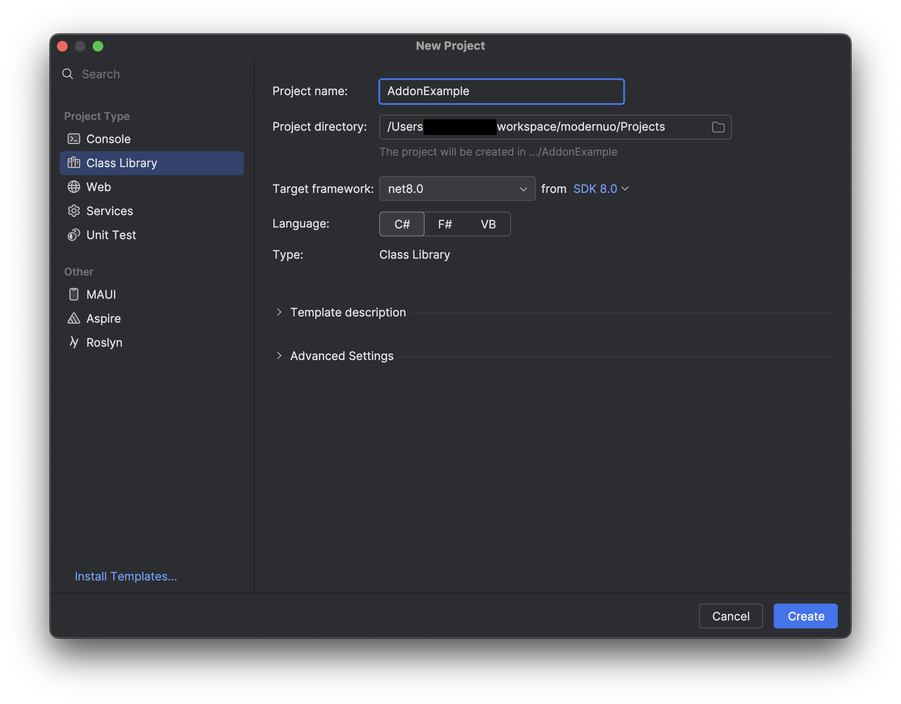

# Addon Assembly Tutorial

## What We'll Do

We're going to make an addon that is a separate `dll` file from the `UOContent.dll`, but has access to code from `Server` and `UOContent`.

Specifically we're going to make a small addon that removes young player status from a player when they login.  This isn't a perfect example because unfortunately when an account is created it's not young yet.  Just... imagine it works the first time they log in.

(note: can probably fix the shortcoming above, but this is a really basic example)

OKAY let's go...

### Create a Project

In your IDE, create a new project in the ModernUO solution.  For this example we'll call it `AddonExample`.  It's important that the project is created as a subdirectory of the `Projects` directory within the repository.



### Configure that Project

The process differs between IDEs, but we want to navigate to and open the `AddonExample.csproj` file.  Replace the contents of the file with the following contents, and we will walk through it step by step.

```xml
<Project Sdk="Microsoft.NET.Sdk">
  <PropertyGroup>
    <RootNamespace>Server.Addon</RootNamespace>
    <AssemblyName>AddonExample</AssemblyName>
    <Product>ModernUO Example Addon</Product>
    <OutDir>..\..\Distribution\Assemblies</OutDir>
    <PublishDir>..\..\Distribution\Assemblies</PublishDir>
    <Configurations>Debug;Release;Analyze</Configurations>
  </PropertyGroup>
  <ItemGroup>
    <ProjectReference Include="..\Server\Server.csproj" Private="false" PrivateAssets="All" IncludeAssets="None">
      <IncludeInPackage>false</IncludeInPackage>
    </ProjectReference>
    <ProjectReference Include="..\UOContent\UOContent.csproj" Private="false" PrivateAssets="All" IncludeAssets="None">
      <IncludeInPackage>false</IncludeInPackage>
    </ProjectReference>
  </ItemGroup>
</Project>
```
#### `PropertyGroup`

* `RootNamespace` is the namespace of our addon and we will use this when we write the code.
* `AssemblyName` will determine the name of the DLL file that gets built.  This is important for configuration later.
* `Product` is an arbitrary name to identify your addon.
* `OutDir` and `PublishDir` shouldn't be changed, the `UOContent.dll` file, for example, is output here, and this is where ModernUO will look for our addon.
* `Configurations` are build configurations, and probably should not change.

#### `ItemGroup` (1)

* `ProjectReference` indicates that we are referencing another project, so that we can reference code in that project in our addon.  We do this twice, once for `Server` and once for `UOContent`.

#### `ItemGroup` (2)

* `AdditionalFiles` indicates we want to copy some files into the build environment.  If we were to add custom items which are saved and loaded from the game we would need to provide migrations for changes in what those items save.

### Write Some Code

The project should have a directory structure something like this at this point.

```
ModernUO
  Projects
    AddonExample
      Class1.cs
```

Remove `Class1.cs` and create a new class called `Addon`.  Replace the code in that generated class with the following contents, and we'll walk through it step by step.

```csharp
using Server.Accounting;

namespace Server.Addon;

public class Addon
{
    public static void Configure()
    {
        EventSink.AccountLogin += AccountLogin;
    }

    public static void Initialize()
    {
    }

    public static void AccountLogin(AccountLoginEventArgs e)
    {
        if (Accounts.GetAccount(e.Username) is not Account account)
        {
            return;
        }

        if (!account.Young)
        {
            return;
        }

        account.RemoveYoungStatus(0);
    }
}
```

#### The Correct Namespace
```csharp
using Server.Accounting; // ignore this for now, we will use it below

// this is the RootNamespace from AddonExample.csproj
namespace Server.Addon;
```

#### The Configure and Initialize Functions

```csharp
    public static void Configure()
    {
        /*
        The Configure function is called once before the World is loaded.
        Do setup steps here.
        */

        // In our case, we're going to add a callback function that will get called
        // whenever the AccountLogin event is raised (magic).
        EventSink.AccountLogin += AccountLogin;
    }

    public static void Initialize()
    {
        /*
        We don't actually use this here, but it's important to know about the Initialize function.
        After the world loads, but before the game starts, this function is called once.
        Do setup steps here.
        */
    }
```

#### Do Something
```csharp
    // This is the function we added to the AccountLogin event above
    public static void AccountLogin(AccountLoginEventArgs e)
    {
        // check if the account exists, if not, return
        if (Accounts.GetAccount(e.Username) is not Account account)
        {
            return;
        }

        // check if account is young, if not we don't care
        if (!account.Young)
        {
            return;
        }

        // remove the young status from the account
        account.RemoveYoungStatus(0);
    }
```

### Load Your Assembly

The file `Distribution/Data/assemblies.json` determines what files ModernUO will load as addons.  Replace it with the following to include our file `AddonExample.dll`.

```json
[
  "UOContent.dll",
  "AddonExample.dll"
]
```

### Run It? I think

I haven't fixed my ModernUO to build on dotnet 9 yet.
