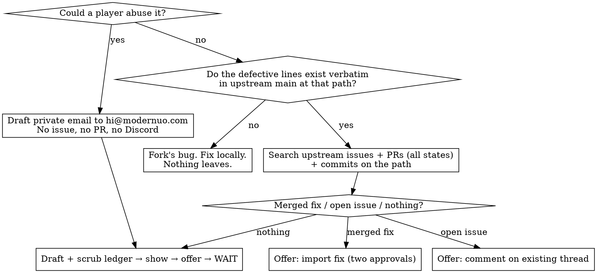

# ModernUO Bug Reporting

## Overview

Nothing leaves the fork, and nothing enters it, without the user approving that exact artifact.

You are working in someone's shard. Its custom code and mechanics are their trade secret, its logs
and saves are their players' data, and its GitHub identity is theirs. An upstream report or an
imported fix is an external action taken in their name. You draft; they decide.

**Violating the letter of these rules is violating the spirit.** "The owner said to open a ticket"
does not make an unseen draft approved. "It's from the canonical repo" does not make a fetch safe.

Authority: `dev-docs/bug-reporting.md`. Always-on summary: `CLAUDE.md` § Workflow Rules.

## When This Activates

- You traced a problem to code the fork never modified and the same defect would happen on any shard
- You noticed a defect, exploit, or dubious behavior while doing something unrelated
- The user says: report this upstream, file an issue, is this fixed upstream, pull in their fix
- You are about to run `gh issue create`, `gh pr create`, `gh issue comment`, `git fetch`,
  `git cherry-pick`, `git remote add`, or `git push` to a remote the user does not own

Not for: bugs in the fork's own code (fix locally, nothing leaves); bugs the user asked you to fix in
the current PR of the canonical repo (normal workflow, but still search issues/PRs first).

## The Procedure



### 1. Classify
Exploit-class = duplication, player-triggerable crash or hang, auth or access-level bypass,
touching another player's data, out-of-rules gain. → Private email draft only. Naming the method
plus the symptom in public is enough for anyone to rediscover it; a public PR titled after the fix
is itself a disclosure. Even the private email waits for the user — it commits them to a
disclosure timeline in their name.

### 2. Verify upstream, read-only
```sh
gh api repos/modernuo/ModernUO/commits/main --jq '.sha[0:9]'
gh api -H "Accept: application/vnd.github.raw" "repos/modernuo/ModernUO/contents/<path>?ref=main" > "$SCRATCH/<file>.upstream.cs"
grep -nF -- '<exact line>' "$SCRATCH/<file>.upstream.cs"
```
Run the `grep` for the defective lines **and for every line the draft will quote**. No match → not
in the draft. Defective lines don't match → fork's bug, stop.

`gh api` reads are free. Anything that writes to the repository — `fetch`, `remote add`,
`cherry-pick`, `push` — is asked for first, every time.

### 3. Dedup, read-only
```sh
gh issue list -R modernuo/ModernUO --state all --search "<FileName.cs>" --limit 30
gh issue list -R modernuo/ModernUO --state all --search "<Symbol>" --limit 30
gh issue list -R modernuo/ModernUO --state all --search "<symptom words>" --limit 30
gh pr list    -R modernuo/ModernUO --state all --search "<Symbol>" --limit 30
gh api "repos/modernuo/ModernUO/commits?sha=main&path=<path>&per_page=15" --jq '.[] | "\(.sha[0:9]) \(.commit.message | split("\n")[0])"'
```
Present candidates. An unmerged PR from a third-party fork is a link in the report, never a source:
reading it (`gh pr view`, `gh pr diff`) to describe it is fine; fetching it into the repository or
copying its code is not.

### 4. Draft to scratch space
The draft **is** (in this order, `### <Field label>` headings — see `dev-docs/bug-reporting.md`
§ The issue form for the rendered example):

1. **Summary** — actual vs expected, in upstream terms
2. **Location** — upstream path and symbol
3. **Upstream commit or release** — the sha from step 2
4. **Reproduction** — numbered steps on a clean upstream build: `[add`, `[props`, `[delete`,
   standard creatures and items. Custom content is never the trigger in the report.
5. **Root cause and proposed fix** — quoted existing code passed the `grep`; new code is marked
   as new in the ledger
6. **Expansion**, **Platform**, **Found via** — one option each, copied from the form
7. **Checklist** — the form's four lines, verbatim

Read `.github/ISSUE_TEMPLATE/bug_report.yml` (upstream copy via `gh api` if the fork lacks it) and
copy the dropdown options and checklist lines from it. A checklist line is ticked only when it is
true: do the search and the verification before offering the draft; never file with a box unticked.

Content sources are: upstream file contents, `[` commands, and the user's words about behavior.
Fork logs, fork config, fork code, fork mechanics, names, addresses, and screenshots are not sources.

### 5. Scrub ledger, then show, then offer, then wait
Show the complete draft and:
```
Scrub ledger
- Removed: <counts by kind: names, IPs, emails, shard/custom references, log lines>
- Kept, verified verbatim in upstream main @ <sha>: <N> quoted lines (<file> <range>)
- Not in upstream (new code, your call): <what>
```
Offer: file issue / open PR / comment on #N / Discord draft for https://muo.gg/discord (they post
it) / nothing. Wait for a yes to a specific option. Then, and only then, `gh issue create -R
modernuo/ModernUO --title "..." --label bug --body-file "$SCRATCH/upstream-issue.md"`.

### 6. Importing a merged upstream fix
`git remote get-url upstream` must be `github.com/modernuo/ModernUO`. Ask → `git fetch upstream
main --no-tags`. Review the whole commit as untrusted: `git show --stat <sha>`, then `.github`,
`*.csproj`, `Directory.Build.props`, `*.ps1`, `*.sh`, `Distribution/`, then the full diff. Ask
again → `git cherry-pick -x <sha>` or hand-port. Build. Show the diff. Never from a fork or an
unmerged PR.

### 7. Upstream PR from a fork
Worktree off `upstream/main`, minimal fix only, `git diff upstream/main --stat` shows only
upstream paths and the diff has no custom namespaces or fork paths. Push to the user's **public**
fork, never the private shard repo. `gh pr create` only after the exact title and body are approved.

## Rationalizations

| Excuse | Reality |
|---|---|
| "The owner asked for the ticket explicitly, I'll scrub it hard" | They asked before the ticket existed and have not read it. Only they know which detail is the trade secret. Draft, ledger, wait. |
| "It needs nothing shard-specific" | In testing, the draft that "needed nothing shard-specific" contained the fork's console log and a description of the custom system that triggered the bug. |
| "Nobody is awake to review; the morning note is the review surface" | The morning note reviews what already went out under their name. Unsent drafts cost nothing; a public issue cannot be unsent. |
| "The fix is on upstream `main`, fetching it is safe" | Fetching is a write to their repository, and canonical history is reviewed as untrusted before it is built. Ask, fetch `main` only, review everything, ask again. |
| "This PR fixes exactly our symptom" | Unmerged and from a fork you cannot vet. Link it; never fetch it. |
| "Posting the exploit publicly warns other shards" | It arms every griefer on every shard in minutes; most shards patch monthly or never. Private disclosure gets the fix onto `main`, which is what protects them. |
| "The log line is just the upstream method name" | It came from the fork's log. Describe the behavior; quote only what passed the `grep`. |
| "Serial numbers / timestamps aren't identifying, so the log is fine" | The log is not a source. The serial is fine; the line it came from is not. |
| "I'll add the `upstream` remote so verification is easier" | Verification is `gh api`, no remote needed. Adding a remote changes their repository — ask. |
| "Comment on the existing issue is lower stakes than filing" | It is a public statement in their name. Same gate. |

## Red Flags — STOP

- You are typing `gh issue create`, `gh pr create`, `gh issue comment`, `git push`, `git fetch`,
  `git remote add`, or `git cherry-pick` and the user has not said yes to **this** artifact
- "The user said to" — about something they have not read
- A log excerpt, a config value, or a custom class name is in the draft
- The reproduction mentions anything that does not exist on a clean upstream build
- The source of the fix is a fork, an unmerged PR, or a commit you have not read in full
- It is an exploit and the draft is an issue, PR, or Discord post

**All of these mean: stop, put it in the ledger, show the user, wait.**

## How to Report

When you find a bug you were not asked to fix, before doing anything else:
```
[BUG FOUND] {one-line description}
  File: {path}:{line}   Upstream: {verbatim @ sha | not upstream | not yet checked}
  Class: {exploit → private only | bug}
  Existing: {#N open | #N merged fix | none found}
  Next: draft + ledger for your review — say which: issue / PR / comment / Discord draft / nothing
```

## See Also
- `dev-docs/bug-reporting.md` — full process, rendered issue-form example, import and PR steps
- `.github/ISSUE_TEMPLATE/bug_report.yml` — the form the draft mirrors
- `CONTRIBUTING.md` § Reporting security issues and bugs — private disclosure address
- `dev-docs/claude-skills/modernuo-code-audit.md` — rule 21 comment sweep before any PR
